# Lab Report 1
## Installing VSCode

- Please install Visual Studio Code by visiting this link: [VSCode Download](https://code.visualstudio.com/download)

    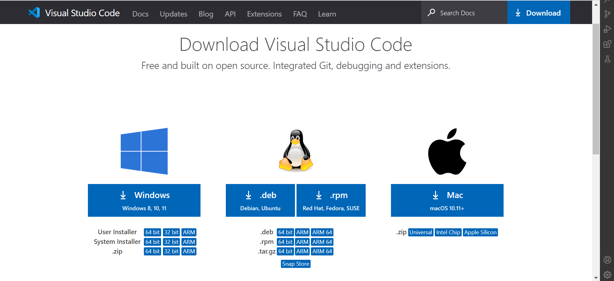

 - Download the appropriate version of VSCode based off of your operating system.
 - Open VSCode to make sure it is working and there are no errors present.

    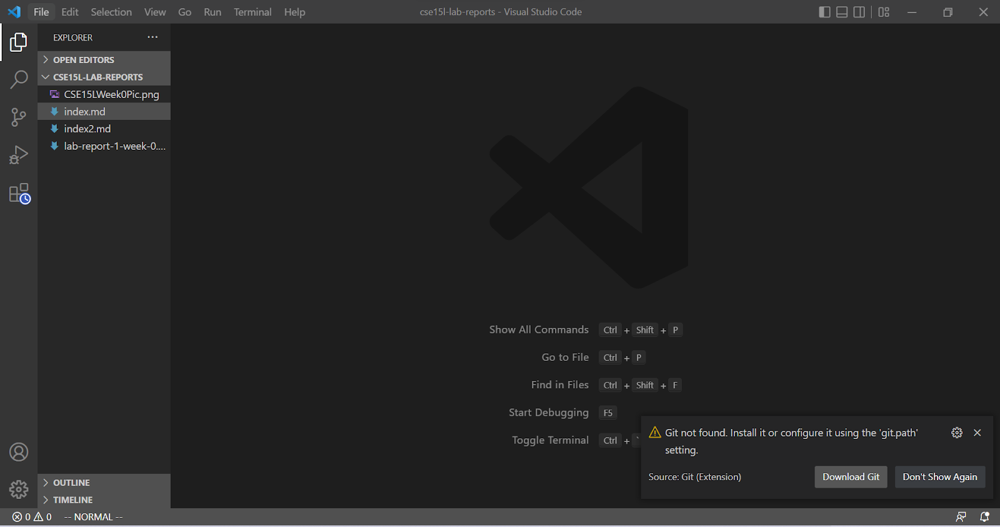

## Remotely Connecting

- Locate your course-specific account for CSE15L by visiting this website: [Account Lookup](https://sdacs.ucsd.edu/~icc/index.php)

    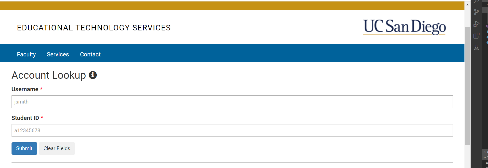

- The appropriate account will begin with "cs15lfa22"

    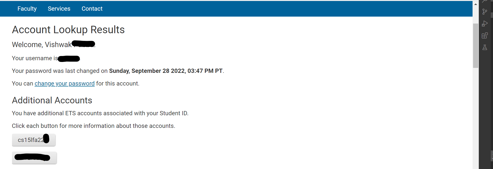

- If you are using a Windows OS, make sure to only download the OpenSSH Client by following the directions on this website: [OpenSSH for Windows](https://learn.microsoft.com/en-us/windows-server/administration/openssh/openssh_install_firstuse?tabs=gui) 

- Once your have located your course-specific account information and installed OpenSSH if necessary, open a terminal and enter the command: `ssh cs15lfa22--@ieng6.ucsd.edu`
    - Make sure to replace the `--` with your unique course-specific login characters

- When prompted, enter your password and then press enter.
- The following will be displayed:

    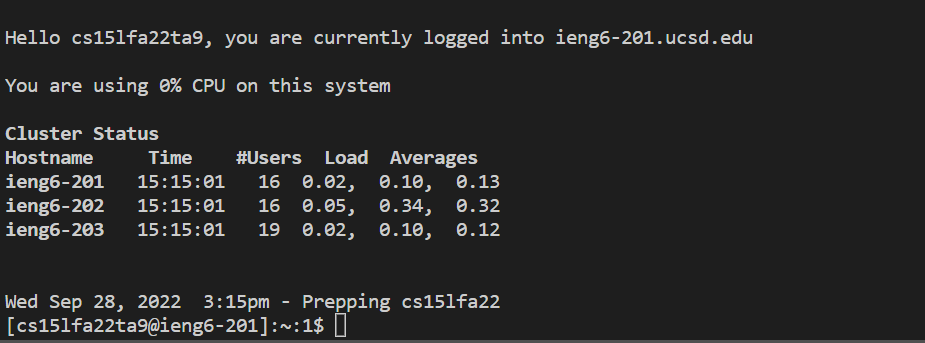

## Trying Some Commands

- Some useful commands to try on the remote desktop:
    - `cd` : used to change current wokring directory
    - `ls` : lists all files and sub-directories in the current directory
        - `ls -a` : lists all files and sub-directories, including hidden files and sub-directories as well
        - `ls <directory>` : lists the all files and subdirectories within a specified directory
    - `pwd` : prints the path of the working directory
    - `mkdir` : can be used to make a new directory
    - `cp` : used to copy files or sub-directories to another directory
    - `cat` : allows the user to write text into a file
    - `exit` : allows the user to terminate the remote access

- Here is an example of the output you recieve when running some of the commands above:

    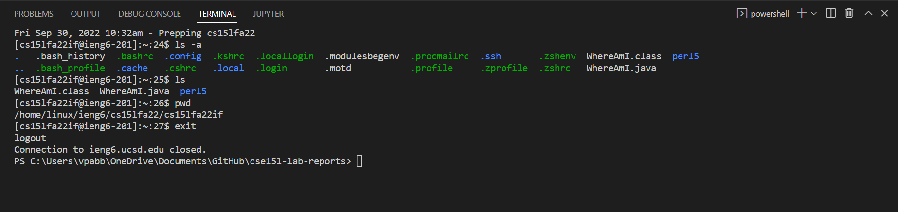

## Moving Files over SSH with `scp`

- We can copy files from your local computer into the remote computer by using the `scp` command: `scp <file name> cs15lfa22--@ieng6.ucsd.edu`
    - Make sure to replace the `--` with your unique course-specific login characters

- After entering your password when prompted, click enter.
- Using the `scp` command, I am able to copy a java file that prints out the os name, the user name, the home directory, and the currnet directory

    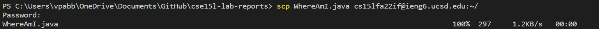
    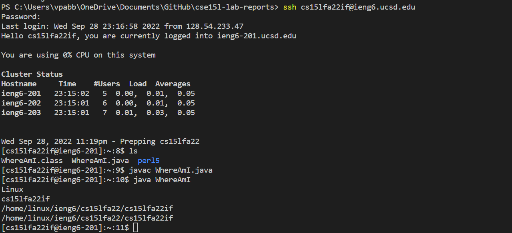

## SSH Keys

- SSH keys can be used to connect to the remote server without having to type in a password.
- `ssh-keygen` is a command that creates a public key, which is stored on the remote server, and a private key, which is stored on the client.
    - The `ssh` command can then use the pair of files to remotely connect in place of the password.
- To setup the `ssh-keygen`, type in the following commands in order:
    - On the client:
        1. `ssh-keygen`
        2. `/Users/<User>/.ssh/id_rsa`
        3. Enter the course specific account password, when prompted.
        4. If you are on Windows, you may need to run the `ssh-add` commands which can be found at this website: [Key-based Authentication in OpenSSH](https://learn.microsoft.com/en-us/windows-server/administration/openssh/openssh_keymanagement#user-key-generation)

            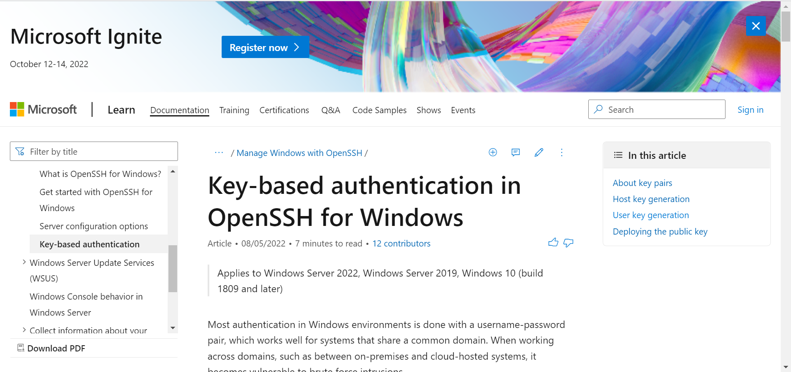

        5. Log onto the remote server with the command: `ssh cs15lfa22--@ieng6.ucsd.edu`
            - Make sure to replace the `--` with your unique course-specific login characters.

        6. Enter your course-specific password when prompted.
    - On the remote server:
        1. `mkdir .ssh`, which will store the public SSH key.
        2. Logout of the remote server.
    - Back on the client:
        1. Run the command: `scp /Users/<User>/.ssh/id_rsa.pub cs15lfa22--@ieng6.ucsd.edu:~/.ssh/authorized_keys`
- Once they SSH keys are setup, you should be able to log into the remote server without entering in a password.

    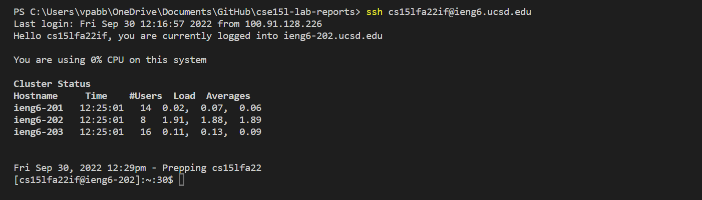

## Making Remote Running Even More Pleasant

- Running multiple commands consecutively can take a longer and waste time, so there are ways to make running commands easier and faster
- When logging into the remote server, you can directly type in commands encased by two quotation marks: `ssh cs15lfa22--@ieng6.ucsd.edu "ls"`

    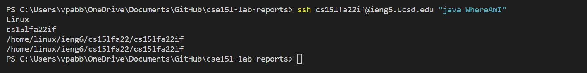
    
- You can also run multiple commands, by having them seperated by a semi-colon.

