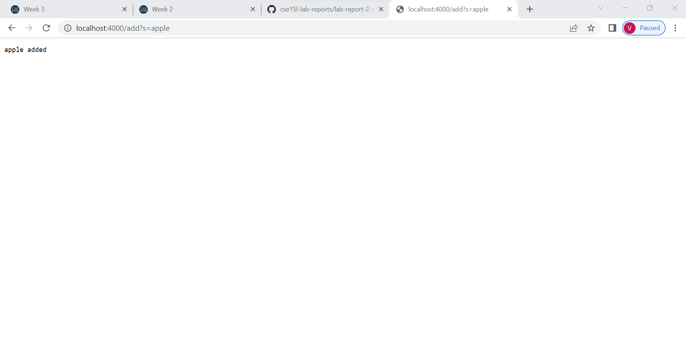
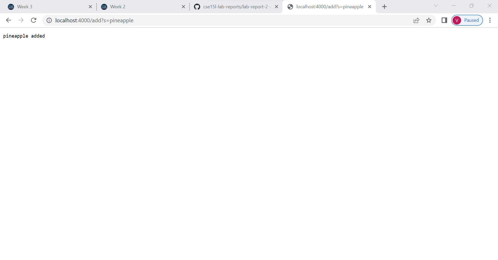
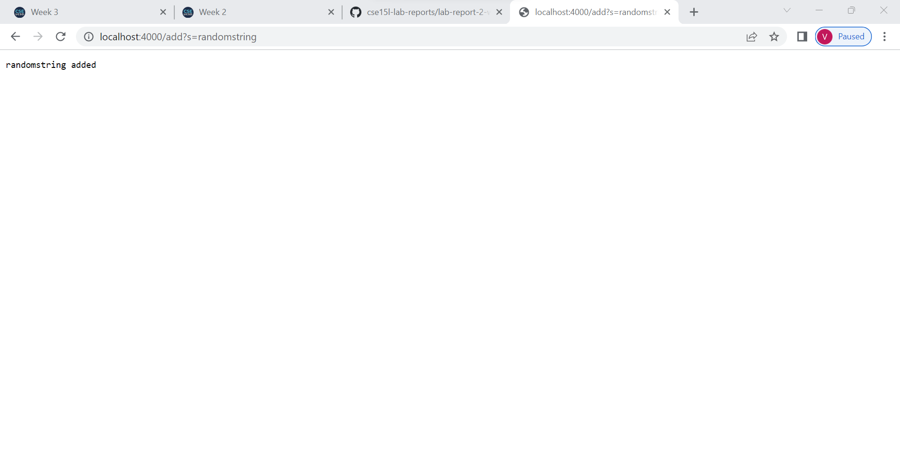
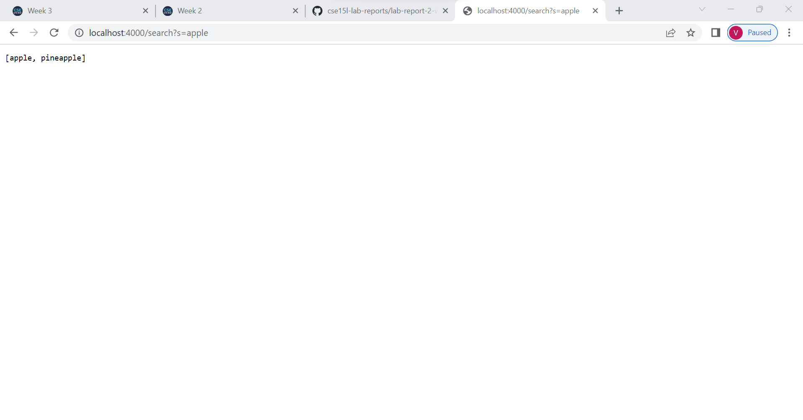
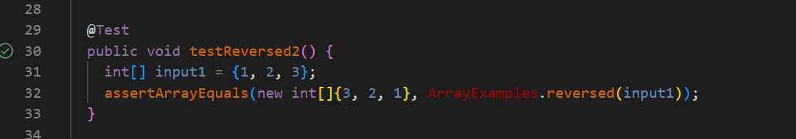
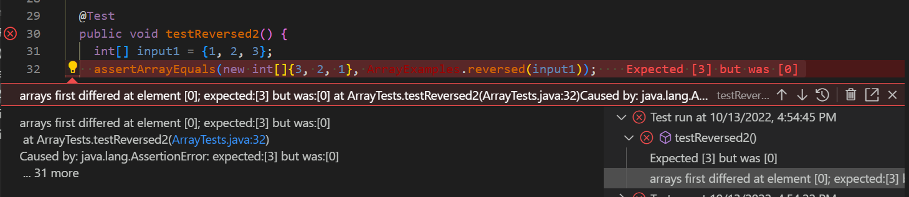
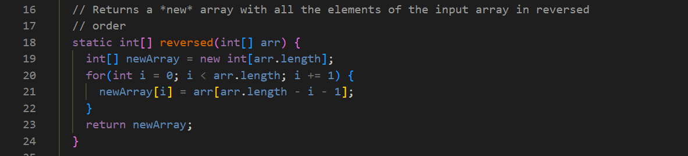
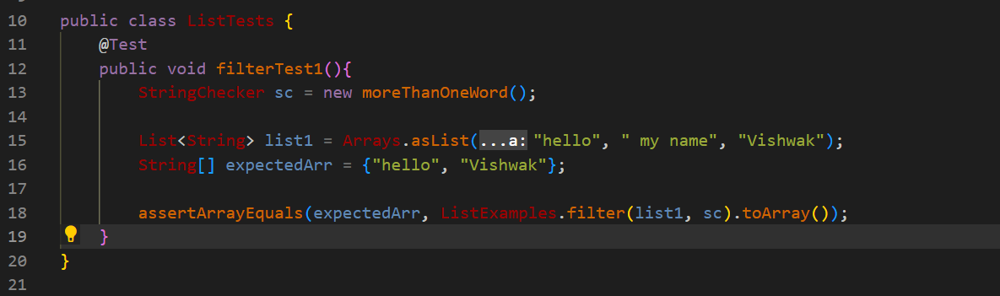
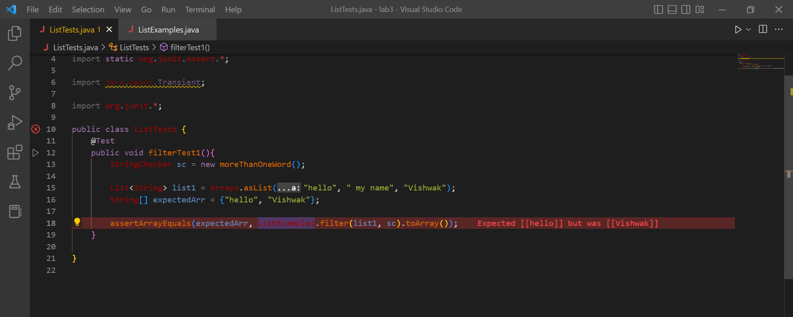
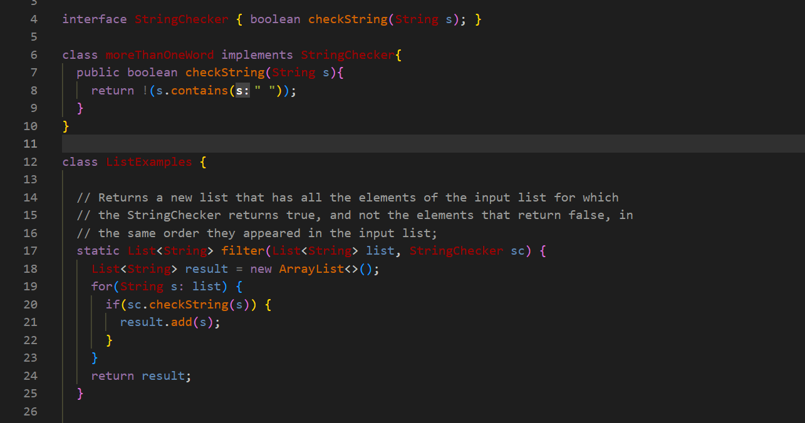

# Lab Report 2
## Part 1

- I implemented a web server that was able to add strings to a list, and returned all strings that contained a given substring to search for.

- The following code is from the SearchEngine.java file:

```
import java.io.IOException; 
import java.net.URI; 
import java.util.ArrayList;

class Handler implements URLHandler { 
    ArrayList<String> words = new ArrayList<String>();

    public String handleRequest(URI url) {
        System.out.println("Path: " + url.getPath());
        if (url.getPath().contains("/add")) {
            String[] parameters = url.getQuery().split("=");
            if (parameters[0].equals("s")) {
                words.add(0, parameters[1]);
                return parameters[1] + " added";
            }
        }
        else if(url.getPath().contains("/search")){
            String[] parameters = url.getQuery().split("=");
            ArrayList<String> chosenWords = new ArrayList<String>();
            if (parameters[0].equals("s")){
                for(int i = 0; i < words.size(); i++){
                    if(words.get(i).contains(parameters[1])){
                        chosenWords.add(0, words.get(i));
                    }
                }
            }
            return chosenWords.toString();
        }
         else if (url.getPath().equals("/")) {
            return "Please add a word or search with keywords!";
         }
        else{
            return "404 Not Found!";
        }
        return "";
    }
}


class SearchEngine{
    public static void main(String[] args) throws IOException {
        if(args.length == 0){
            System.out.println("Missing port number! Try any number between 1024 to 49151");
            return;
        }

        int port = Integer.parseInt(args[0]);

        Server.start(port, new Handler());
    }
}
```
- If the URL path contains `add`, it will initiate the command to add a string value to an arraylist. 

    - In this following image, I use the `add` command which takes the String value, `apple`, as an argument.

    
    
    - In the next image, I use the `add` command twice with `pineapple` and `randomstring` as my arguments.

    
    

- If the URL path contains `search`, it will search from the indicated substring through the list of added words, and then return the strings with the substring.

    - In the following image, I use the `search` command with the substring argument, `apple`, and the output is shown to be `[apple, pineapple]`, which are both of the words that contain the substring.

    

## Part 2

### Array `reversed` Method

- Failure-inducing Input:

    - For the test, I decided on the input of `[1, 2, 3]`, and it should return a new array equal to `[3, 2, 1]`.

    

- Symptom:

    - When the test was run, the value at `newArray[0]` was `0`, instead of `3`.

    

- Bug Fix:

    - I switched the assignment of array values, so that the values at each index of `newArray` would be updated rather than at each index of `arr`.
    
    

- Explanation:

    - Because `arr[i]` was being updated during each iteration of the for-loop, the values in `newArray` remained the same. 
    - Because the values in `newArray` was not initialized with values, it had `0` at every index. 
    - Because `newArray` was not updated, the value at `newArray[0]` was still `0`, not `3`.

### List `filter` Method

- Failure-inducing Input:

    - For this test, I basically input a list of string phrases and words, `["hello", "my name", "Vishwak"]`, and a implementation of the `StringChecker` interface called `moreThanOneWord`, which returned true if the string contained a single word.

    - The output I expected from the test was `["hello", "Vishwak"]`.

    

- Symptom:

    - When the test was run, the value at `result.get(0)` was `"Vishwak"`, instead of `"hello"`.

    

- Bug Fix:

    - In the if-statement, I changed the `.add` function to not contain an index to add the new value at.

    

- Explanation:

    - Because the `.add` function contains an index when called in the method, everytime a new value is passed through the filter, the new value is added at the index. 
    - In this method, the index is set at `0`, so every valid string will be added to the front, and so the strings values would be reversed in the new list.

