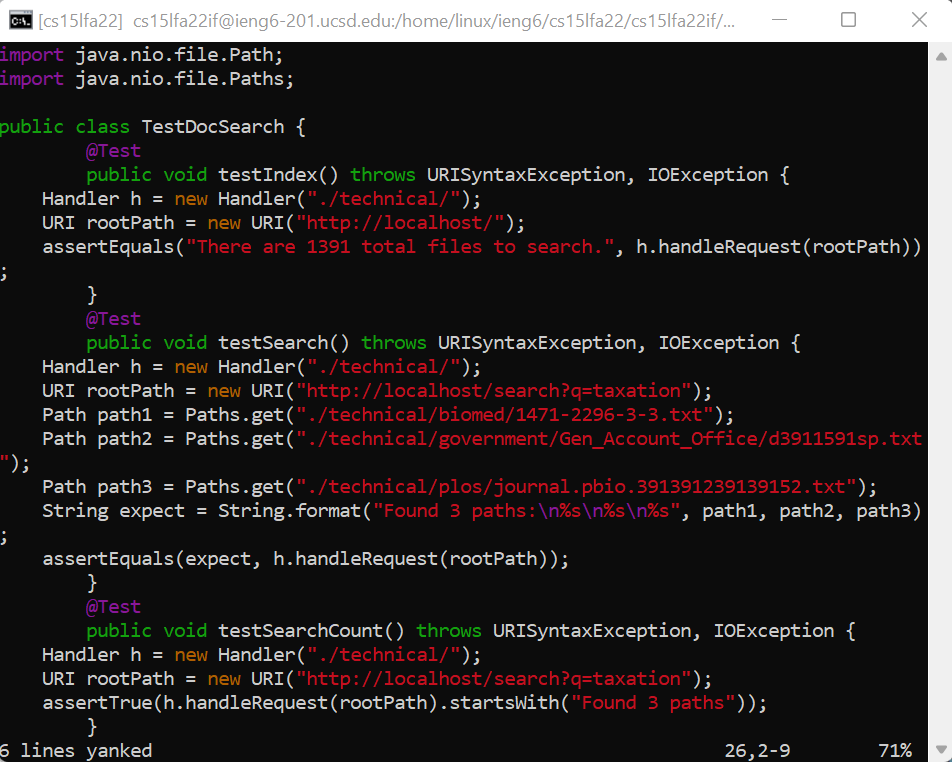
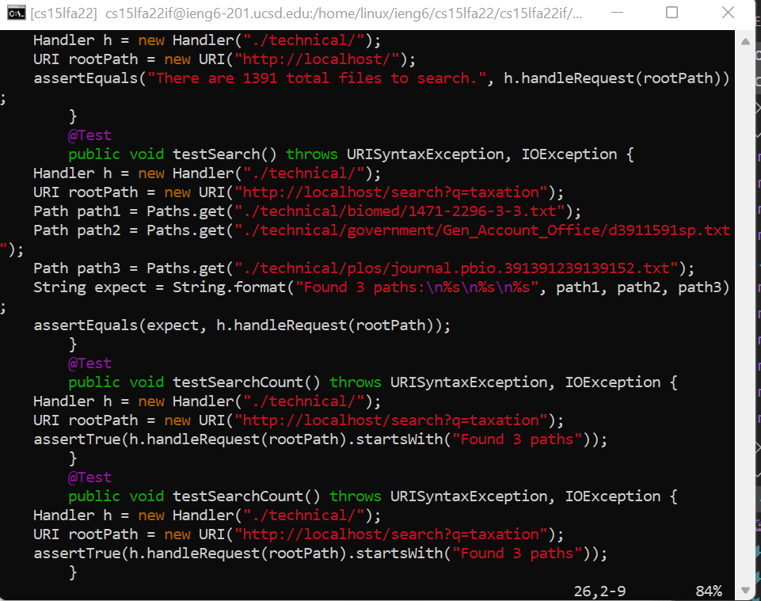
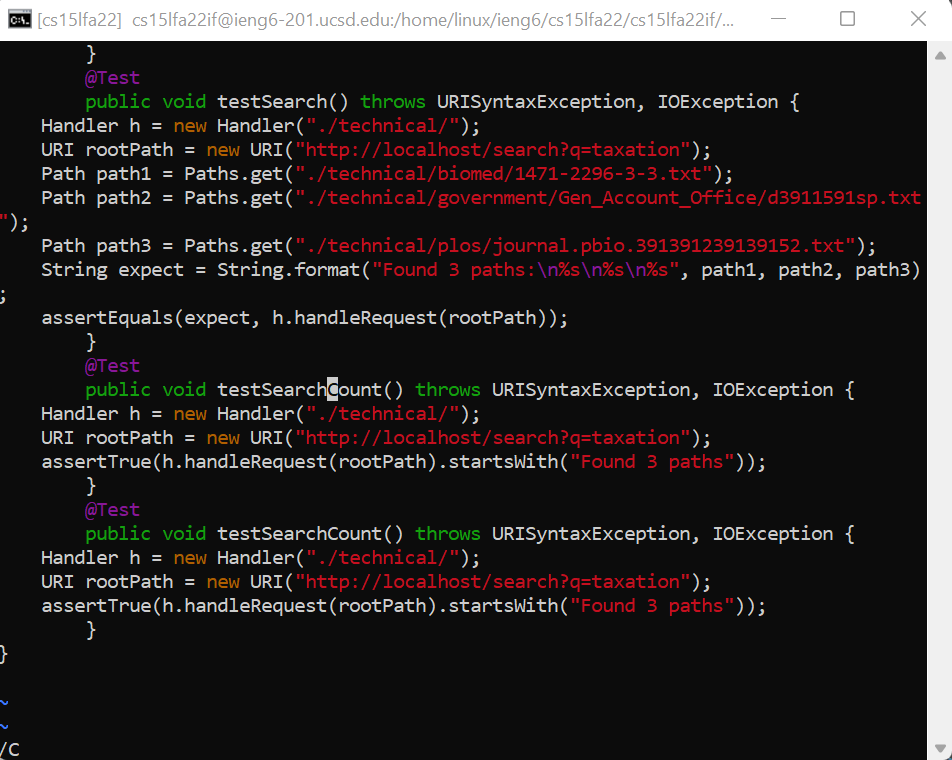
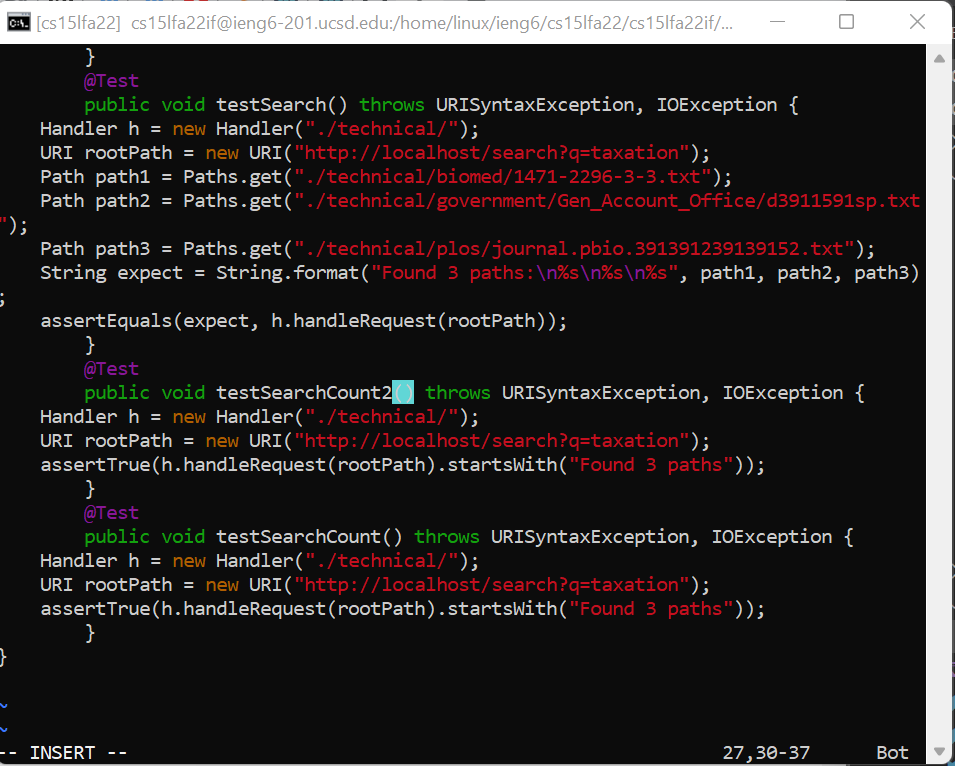
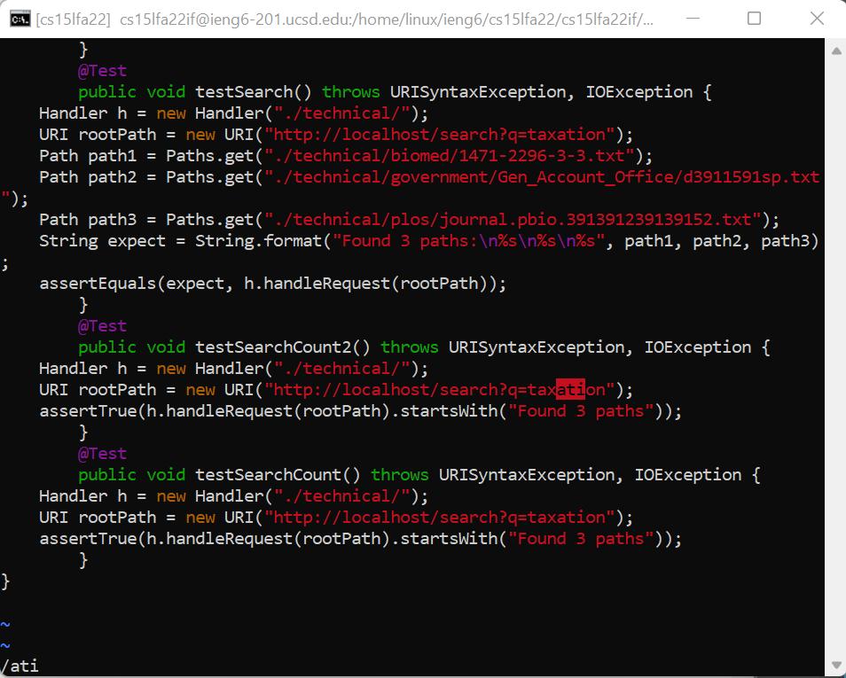

# Lab Report 4

## Part 1

 - In our lab group, we attempted the challenge task:
 
    `In TestDocSearch.java, copy the test called testSearchCount, rename the new test to testSearchCount2 and change the query string being tested to tax rather than taxation.`

- The steps we took (27 keystrokes):

    1. `/@ <Enter> nn`

        

    3. `6yy`

        

    4. `kp`

        

    5. `/C <Enter>`

        

    7. `ea2 <Esc>`

        

    8. `/ati <Enter>`

        

    10. `5x` 

        

    11. `:w <Enter>`

        

## Part 2

### Method 1: Local Edit in VSCode

- This method took me approximately 2 minutes and 29 seconds. This method was a lot slower than the second method, and I believe it was due to the running the `scp command` and then moving the file into the appropriate directory. Especially with the `scp` command, there was a lot to type out which limited my speed while completing this method.Editing the file also seemed slower because I relied heavily on the use of my mouse, rahter than simply using my keyboard.

### Method 2: Remote Edit using VIM

-  This method took me approximately 1 minute and 9 seconds. This method was more than 2 times faster than method one. Because I edited the file directly on the remote server, I did not need to remote copy and could run `bash test.sh` immediately after editing the file. 

### Which of these two styles would you prefer using if you had to work on a program that you were running remotely, and why?

- I would prefer to use the stype where I could edit the file on a remote server using VIM, if I were working on a program running remotely. This is because it reduces the hassle of remotely copying the file from your local computer to the remote server and subsequently moving the file into the appropriate directory.

### What about the project or task might factor into your decision one way or another? (If nothing would affect your decision, say so and why!)

 - If the project or task required more resources to run, I would prefer to use the second method by running and editing the project on a remote server. Otherwise, I would use the first method of editing on my local computer because of the ease of access and comfort of using an IDE, such as VSCode. Although, I could always remotely copy the file into the remote server if I needed to make any scripts or run it on there. 