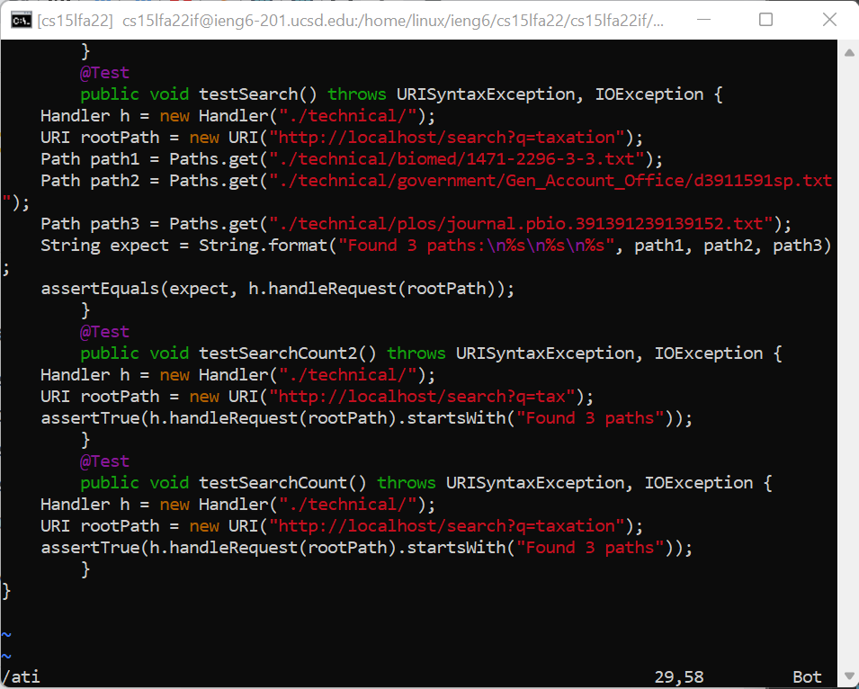

# Lab Report 4

## Part 1

 - In our lab group, we attempted the challenge task:
 
    `In TestDocSearch.java, copy the test called testSearchCount, rename the new test to testSearchCount2 and change the query string being tested to tax rather than taxation.`

- The steps we took (27 keystrokes):

    1. `/@ <Enter> nn`

        

    3. `6yy`

        

    4. `kp`

        

    5. `/C <Enter>`

        

    7. `ea2 <Esc>`

        

    8. `/ati <Enter>`

        

    10. `5x` 

        

    11. `:w <Enter>`

        

## Part 2

