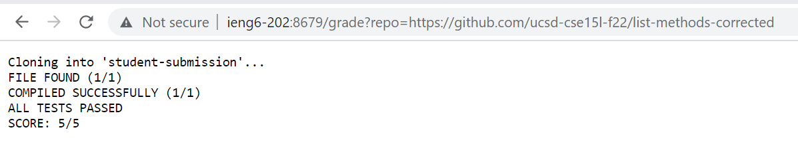
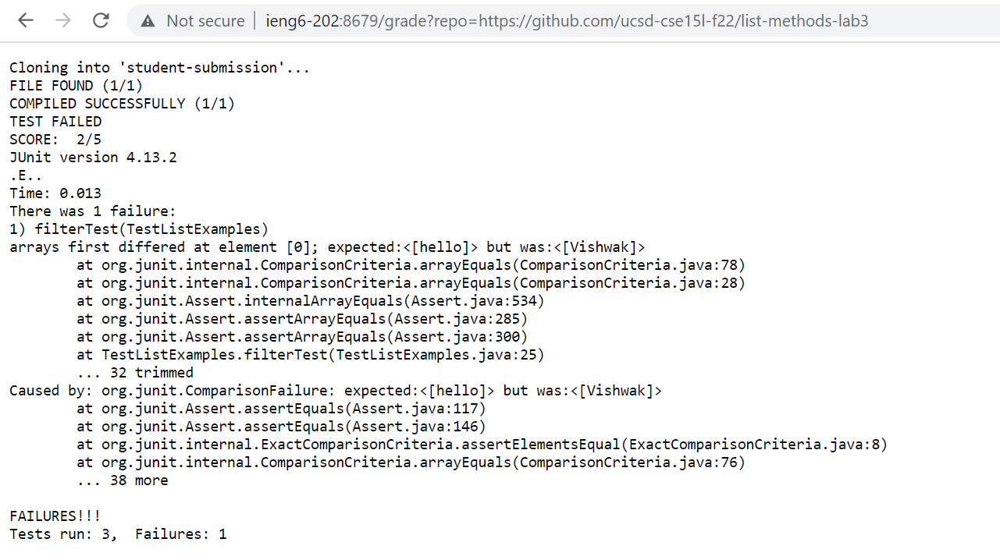
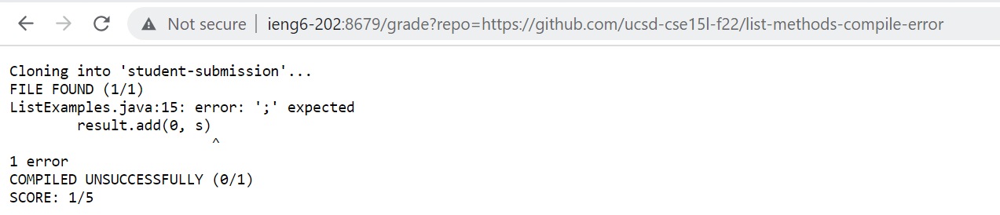

# Lab Report 5

## Grading Submission Script

```
set -e
rm -rf student-submission
mkdir student-submission

git clone $1 student submission

cp TestListExamples.java student-submission
cd student-submission

CPATH=.:../lib/hamcrest-core-1.3.jar:../lib/junit-4.13.2.jar

if [[ -f ListExamples.java ]];
then
    echo "FILE FOUND (1/1)"
else
    echo "FILE NOT FOUND (0/1)"
    echo "SCORE: 0/5"
    exit 1
fi

set +e

javac -cp $CPATH *.java > compile-err.txt

if [[ $? -eq 0 ]]
then
    echo "COMPILED SUCCESFFULLY (1/1)"
else
    echo "COMPILED UNSUCCESSFULLY (0/1)"
    echo "SCORE: 1/5"
    cat compile-err.txt
    exit 2
fi

java -cp $CPATH org.junit.runner.JUnitCore TestListExamples > test-err.txt

if [[ $? -eq 0 ]]
then 
    echo "ALL TESTS PASSED"
    echo "SCORE: 5/5"
    exit
else
    echo "TEST FAILED"
    echo "SCORE: 2/5"
    cat test-err.txt
    exit 3
fi
```

### Example 1
- Repository Link: [https://github.com/ucsd-cse15l-f22/list-methods-corrected](https://github.com/ucsd-cse15l-f22/list-methods-corrected)


### Example 2
- Repository Link: [https://github.com/ucsd-cse15l-f22/list-methods-lab3](https://github.com/ucsd-cse15l-f22/list-methods-lab3)



### Example 3
- Repository Link: [https://github.com/ucsd-cse15l-f22/list-methods-compile-error](https://github.com/ucsd-cse15l-f22/list-methods-compile-error)



## Script Trace

```
set -e
rm -rf student-submission
mkdir student-submission

git clone $1 student submission

cp TestListExamples.java student-submission
cd student-submission

CPATH=.:../lib/hamcrest-core-1.3.jar:../lib/junit-4.13.2.jar
```

- `set -e` is used to exit the code immediately if the exit code is not 0.
- The script removes the previous student-submission and creates a new directory. This is where the git repository is cloned into, and `TestListExamples.java` is moved into this new directory. 
- The script moves into the student-submission directory. 
- `CPATH` is used as a variable to store the jUnit command so it easy to call.

```
if [[ -f ListExamples.java ]];
then
    echo "FILE FOUND (1/1)"
else
    echo "FILE NOT FOUND (0/1)"
    echo "SCORE: 0/5"
    exit 1
fi

set +e
```
- Using the `-f` command, the script will search if the `ListExamples.java` file exists.
    - If the file exists, the script will award the student with 1 point.
    - Else, the script will not award the student with any points and will exit immediately.
- The `set +e` command is used so the script will not immediately exit when an exit code is used.

```
javac -cp $CPATH *.java > compile-err.txt

if [[ $? -eq 0 ]]
then
    echo "COMPILED SUCCESFFULLY (1/1)"
else
    echo "COMPILED UNSUCCESSFULLY (0/1)"
    echo "SCORE: 1/5"
    cat compile-err.txt
    exit 2
fi
```
- Using the `javac` command, all of the java files in the folder are compiled, and its stderr is redirected to `compile-err.txt` if it exists.
- The if-statement will compare the exit code of the compiling to see if it is equal to 0.
    - If the exit code is 0, the student is awarded 1 point for compiling properly.
    - Else, the student is given no points, the stderr is written to compile-err.txt for students to see why they did not recieve points, and the script exits.

```
java -cp $CPATH org.junit.runner.JUnitCore TestListExamples > test-err.txt

if [[ $? -eq 0 ]]
then 
    echo "ALL TESTS PASSED"
    echo "SCORE: 5/5"
    exit
else
    echo "TEST FAILED"
    echo "SCORE: 2/5"
    cat test-err.txt
    exit 3
fi
```
- Using the `java` function, TestListExamples will be run and the stderr will be written to test-err.txt if it exists.
- The if-statement will compare the exit code of the `java` command to see if it is equal to 0.
    - If the exit code is 0, the student will recieve full points for passing all the tests.
    - Else, the student is given no points, the stderr is written to test-err.txt for students to see why they did not recieve points, and the script exits.

